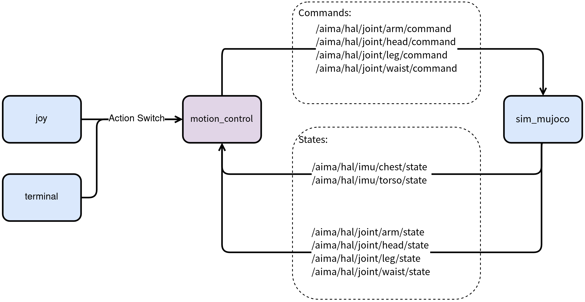

# X2 RL Deployment

> 注意：示例程序只在仿真环境中验证通过，如果需要通过本示例控制真实的 **灵犀X2** 机器人，需要重新进行参数适配
- 为用户部署自训练的强化学习模型提供一个简单示例
- 本示例所使用的强化学习模型是一段舞蹈动作，并且提供了模型控制和简单的推理器参考代码
- 完成本示例后，用户可自行替换 `onnx` 模型文件，并在 `motion_control_node.cc` 的 `RlDefault` 函数中适配您的 policy，完成自定义模型的部署

## 1. 环境依赖
``` bash
# 本项目依赖 ros2 humble 环境，如果您还没有具备对应环境，可参考下方的命令进行安装
# wget http://fishros.com/install -O fishros && chmod +x ./fishros && ./fishros

sudo apt install libgflags-dev
sudo apt install libyaml-cpp-dev

# 以下依赖需要上位机有 ros2 humble 环境
sudo apt install ros-humble-joy
sudo apt install ros-humble-grid-map-msgs
sudo apt install ros-humble-grid-map-ros
sudo apt install ros-humble-rmw-cyclonedds-cpp

# 下载 onnxruntime
# 参考下载链接：https://github.com/microsoft/onnxruntime/releases/download/v1.23.2/onnxruntime-linux-x64-1.23.2.tgz

# 1. 解压文件
tar -zxvf onnxruntime-linux-x64-1.23.2.tgz
# 2. 拷贝头文件至系统目录
sudo mkdir -p /usr/local/include/onnxruntime
sudo cp -r onnxruntime-linux-x64-1.23.2/include/* /usr/local/include/onnxruntime/

# 3. 拷贝库文件到系统目录
sudo cp -r onnxruntime-linux-x64-1.23.2/lib/* /usr/local/lib/
sudo mkdir -p /usr/local/lib64
sudo cp -r onnxruntime-linux-x64-1.23.2/lib/* /usr/local/lib64/

# 4. 更新动态库缓存
sudo ldconfig
```

## 2.快速使用

### 2.1. 运控部署 example 启动
- 进入工程目录
``` bash
cd x2_rl_deploy
```

- 编译项目
``` bash
colcon build
```

- 加载环境变量
``` bash
source /opt/ros/humble/setup.bash
source install/local_setup.bash
```

- 运行运控 example
``` bash
ros2 run x2_rl_deploy_controller x2_rl_deploy_controller
```

### 2.2. 仿真节点启动
- 进入工程目录
``` bash
cd x2_rl_deploy/x2_rl_deploy_mujoco
```

- 加载环境变量
``` bash
source /opt/ros/humble/setup.bash
source ../install/local_setup.bash
```

- 运行 仿真环境
``` bash
cd bin
./start_sim.sh -s
```
请在命令行选择 `0: lx2501_3_t2d5`  

### 2.3. 遥控器节点启动
在执行下述命令前，请先通过 usb-c 连接您的 PS5 手柄到上位机

- 启动遥控节点
``` bash
source /opt/ros/humble/setup.bash
ros2 run joy joy_node
```

### 2.4. 运行 RL 模型示例
启动上述的 RL 部署 example、仿真和遥控器三个节点后即可运行 RL 模型示例：
1. 切换至位控模式（可选）
2. 调整好机器人位姿后，按下 PS5 手柄的 🟥 进入 RL 部署模式示例
3. 结束后可按下 ⭕️ 进入阻尼模式

调整仿真中机器人位姿的方式：
1. **[建议优先选用该方法]** `Backspace` 可重置 mujoco 中机器人的位置
2. 双击选中目标关节后，使用 `ctrl + 鼠标左键` 可旋转目标关节
3. 双击选中目标关节后，使用 `ctrl + 鼠标右键` 可拖拽目标关节


## 3. 按键映射
```
❌ - PASSIVE_DEFAULT（零力矩模式）
⭕️ - DAMPING_DEFAULT（阻尼模式）
🔺 - JOINT_DEFAULT  （位控模式）
🟥 - RL_DEFAULT     （RL 部署模式示例）
```
1. `零力矩模式` 为默认模式
2. `阻尼模式` 为安全模式
3. 建议先切换到 `位控模式` 后进入 `RL 部署模式示例`

## 4. 目录结构
``` bash
x2_rl_deploy
├── aimdk_msgs/                     # 自定义消息包
│   ├── CMakeLists.txt
│   ├── interface/
│   └── package.xml
├── format.sh
├── rl_deploy_topology.png
├── README.md                        # 本文件
├── x2_rl_deploy_controller/
│   ├── CMakeLists.txt
│   ├── config/                      # 配置项目录
│   │   ├── motion_control.yaml      # 运动控制配置文件（包含初始位姿与 RL 示例所需配置）
│   │   └── rl_model/                # ONNX 模型文件目录
│   ├── include/
│   │   └── x2_rl_deploy_controller/
│   ├── package.xml
│   └── src/                         # 源码目录
│       ├── main.cc                  # 程序入口
│       ├── motion_control_node.cc   # 运控节点实现
│       └── predictor/               # ONNX 推理器
└── x2_rl_deploy_mujoco/
    ├── bin/                         # 仿真可执行文件目录
    ├── COLCON_IGNORE
    ├── configuration/               # mujoco 相关配置文件
    ├── lib/
    └── version.json                 # 版本信息
```

## 5. 模型部署
- 下文中使用 `<model_name>.onnx` 表示不同的模型
- 运行前请将训练好的onnx模型文件拷贝到`x2_rl_deploy_controller/config/rl_model`，并替换`x2_rl_deploy_controller/config/motion_control.yaml`中对应路径
``` bash
rl_config:
  policy:
    type: "onnx"
    device: "cpu"
    path: "x2_rl_deploy_controller/config/rl_model/<model_name>.onnx"
```

- 调整代码以适配您的 policy
``` bash
# 可按需自定义 RlDefault() 函数以适配您的 policy
x2_rl_deploy_controller/src/motion_control_node.cc  
```

## 6. 通讯协议
### 6.1. 通信拓扑

### 6.2. 关节状态订阅话题

| Joint | Publisher | Subscription | Topic name | Data type | Frequency (Hz) |  
| :--- | :--- | :--- | :--- | :--- | :--- |
| **手臂** | hal_ethercat | mc | `/aima/hal/joint/arm/state` | `aimdk_msgs/msg/JointStateArray` | 1000 |
| **腰部** | hal_ethercat | mc | `/aima/hal/joint/waist/state` | `aimdk_msgs/msg/JointStateArray` | 1000 |
| **腿部** | hal_ethercat | mc | `/aima/hal/joint/leg/state` | `aimdk_msgs/msg/JointStateArray` | 1000 |
| **头部** | hal_ethercat | mc | `/aima/hal/joint/head/state` | `aimdk_msgs/msg/JointStateArray` | 1000 |

### 6.3. IMU 状态订阅话题

| Joint | Publisher | Subscription | Topic name | Data type | Frequency (Hz) |  
| :--- | :--- | :--- | :--- | :--- | :--- |
| **胸腔** | hal_imu | mc | `/aima/hal/imu/chest/state` | `sensor_msgs/msg/Imu` | 500 |
| **髋部** | hal_imu | mc | `/aima/hal/imu/torso/state` | `sensor_msgs/msg/Imu` | 500 |

### 6.4. 控制指令发布话题

| Joint | Publisher | Subscription | Topic name | Data type | Frequency (Hz) |  
| :--- | :--- | :--- | :--- | :--- | :--- |
| **手臂** | mc | hal_ethercat | `/aima/hal/joint/arm/command` | `aimdk_msgs/msg/JointCommandArray` | 500 |
| **腰部** | mc | hal_ethercat | `/aima/hal/joint/waist/command` | `aimdk_msgs/msg/JointCommandArray` | 500 |
| **腿部** | mc | hal_ethercat | `/aima/hal/joint/leg/command` | `aimdk_msgs/msg/JointCommandArray` | 500 |
| **头部** | mc | hal_ethercat | `/aima/hal/joint/head/command` | `aimdk_msgs/msg/JointCommandArray` | 500 |
